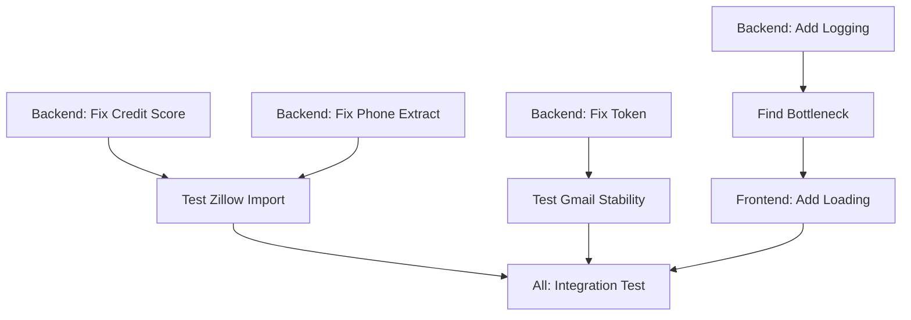

# Day 9 Critical Fixes - Task Coordination Document
**Date**: 2025-08-13
**Created by**: Claude 2 (Backend)
**For**: Claude 1 (Orchestrator) to coordinate

## 🚨 Executive Summary

Multiple critical issues discovered during Gmail integration testing:
- **3 Zillow leads failed** to import (database type mismatch)
- **Gmail disconnects** frequently (token refresh issue)
- **Lead deduplication broken** (phone placeholder causing overwrites)
- **105-second API timeouts** (no performance logging to diagnose)
- **Database schema mismatch** between migrations and Supabase

## 📊 Priority Matrix

### P0 - Critical (Fix Today)
| Issue | Impact | Owner | Time |
|-------|--------|-------|------|
| Credit score integer error | Blocks Zillow imports | Backend | 30 min |
| Phone deduplication bug | Overwrites existing leads | Backend | 45 min |
| Gmail token expiration | Disconnects every ~10 min | Backend | 1 hour |

### P1 - High (Fix Tomorrow)
| Issue | Impact | Owner | Time |
|-------|--------|-------|------|
| 105-second API timeout | Terrible UX | Backend + Frontend | 2 hours |
| Missing performance logs | Can't diagnose issues | Backend | 1 hour |
| Phone extraction failure | Missing contact info | Backend | 1 hour |

### P2 - Medium (This Week)
| Issue | Impact | Owner | Time |
|-------|--------|-------|------|
| Database schema mismatch | Future bugs | Orchestrator | 30 min |
| Credit score display | Shows as number not range | Frontend | 30 min |

## 🎯 Detailed Issues & Solutions

### Issue 1: Credit Score Database Mismatch
**Problem**: 
- Parser sends: `"660-719"` (string)
- Database expects: INTEGER
- Migration shows: VARCHAR(50)

**Evidence**:
```
Error: "invalid input syntax for type integer: \"660-719\""
Failed leads: Rachel, Mackenzie, Victoria
```

**Solutions**:
1. **Quick Fix** (Claude 2 already applied): Convert range to midpoint integer
2. **Proper Fix**: Change Supabase column to VARCHAR(50)
3. **Best Fix**: Store both min and max as separate integers

### Issue 2: Phone Number Deduplication
**Problem**: 
- Zillow parser uses `"9999999999"` when phone not found
- Multiple leads get same ID (330) due to same phone
- Real phones exist in HTML but not extracted

**Evidence**:
```
Julia (ID:330, Phone:9999999999)
Miguel (ID:330, Phone:9999999999) <- Same ID!
Gabriella (ID:330, Phone:9999999999) <- Same ID!
```

**Solutions**:
1. Extract phone from "contact info" link in HTML
2. Use email for deduplication when phone missing
3. Generate unique placeholder phones

### Issue 3: Gmail Token Expiration
**Problem**: 
- Token expires after ~10 minutes
- No automatic refresh happening
- User must reconnect manually

**Evidence**:
```
First check: {"isConnected":true,"email":"toma@plusrealtors.com"}
10 minutes later: {"isConnected":false}
```

**Solutions**:
1. Implement token refresh interval (every 50 minutes)
2. Save refresh_token to file system
3. Check and refresh before each API call

### Issue 4: Performance Issues
**Problem**: 
- API takes 105 seconds to respond
- No logging to identify bottleneck
- Frontend shows no loading state

**Evidence**:
- Claude 1 found 105-second delay
- No timing logs in codebase
- Users think app is frozen

**Solutions**:
1. Add timing logs to all database queries
2. Add API request/response logging
3. Frontend loading indicators
4. Request timeout handling

## 👥 Task Assignments

### Claude 1 (Orchestrator) - 2 hours
```markdown
1. [ ] Verify Supabase schema matches migrations (30 min)
   - Check credit_score column type
   - Document any mismatches
   - Create migration script if needed

2. [ ] Coordinate testing between Claudes (1 hour)
   - Test Gmail import with all 3 Claudes
   - Verify fixes work together
   - Document results

3. [ ] Update CURRENT-STATE.md with fixes (30 min)
   - Record all changes made
   - Update known issues list
```

### Claude 2 (Backend) - 4 hours
```markdown
1. [ ] Fix Phone Extraction (45 min)
   - Parse phone from HTML "contact info" links
   - Update zillowParser.js
   - Test with real emails

2. [ ] Add Performance Logging (1 hour)
   - Create /src/utils/logger.js utility
   - Add timing to leadModel.js queries
   - Add API timing to controllers
   - Log slow operations (>1000ms)

3. [ ] Fix Gmail Token Refresh (1 hour)
   - Add refresh interval timer
   - Store refresh_token properly
   - Test disconnection prevention

4. [ ] Fix Credit Score Handling (30 min)
   - Ensure midpoint conversion works
   - Add validation for ranges
   - Handle edge cases

5. [ ] Document API bottleneck (45 min)
   - Add detailed logging to GET /api/leads
   - Identify 105-second delay cause
   - Propose optimization
```

### Claude 3 (Frontend) - 2.5 hours
```markdown
1. [ ] Add Loading States (1 hour)
   - Skeleton loader for leads page
   - Progress indicator for long operations
   - Timeout warnings after 30 seconds

2. [ ] Add Performance Monitoring (45 min)
   - Log API call durations
   - Show timing in dev mode
   - Alert on slow responses

3. [ ] Fix Credit Score Display (45 min)
   - Show ranges when available
   - Handle both integer and string formats
   - Add tooltip explaining scores
```

## 🔄 Dependencies & Order



## ✅ Success Metrics

### How we know it's fixed:
1. **Zillow Import**: All 3 failed leads import successfully
2. **Gmail Stable**: Stays connected for >1 hour
3. **No Duplicates**: Each lead gets unique ID
4. **Performance**: API responds in <5 seconds
5. **Logging**: Can see exact timing for each operation

## 🧪 Test Plan

### Test Commands:
```bash
# Test Zillow import
curl -X POST http://localhost:3001/api/gmail/import-emails \
  -H "Content-Type: application/json" \
  -d '{"labelId": "Label_16", "maxEmails": 5}'

# Check for duplicates
curl http://localhost:3001/api/leads | grep -c '"id":330'

# Test performance
time curl http://localhost:3001/api/leads

# Check Gmail stability (run every 10 min)
curl http://localhost:3001/api/gmail/status
```

## 📝 Communication Protocol

1. **Start**: Each Claude posts in AGENT-COMMUNICATION-LOG.md when starting
2. **Blockers**: Tag blocking Claude with @[name] 
3. **Completion**: Update this document with ✅ when task done
4. **Testing**: All Claudes test together at 4pm checkpoint

## 🚀 Launch Sequence

1. **9:00 AM**: Claude 1 reviews this document
2. **9:30 AM**: Claude 2 starts backend fixes
3. **10:00 AM**: Claude 3 starts frontend work
4. **2:00 PM**: Integration testing begins
5. **4:00 PM**: Final testing and documentation

## 💡 Additional Notes

- **Database Access**: If schema change needed, coordinate with user
- **Workarounds OK**: Quick fixes acceptable if documented
- **Test Data**: Use existing Gmail "processed-lead" label (201 emails)
- **Rollback Plan**: Keep backup of working parsers

---

**For Claude 1**: Please review and adjust priorities/assignments as needed. This is a suggested plan based on my analysis as Backend Claude.